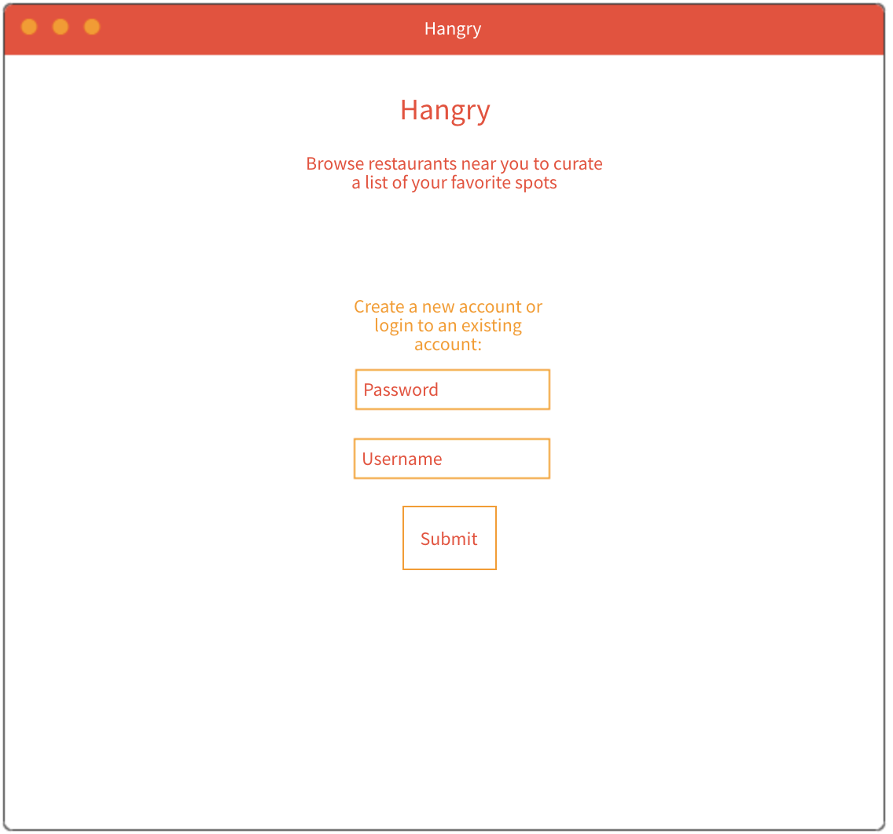
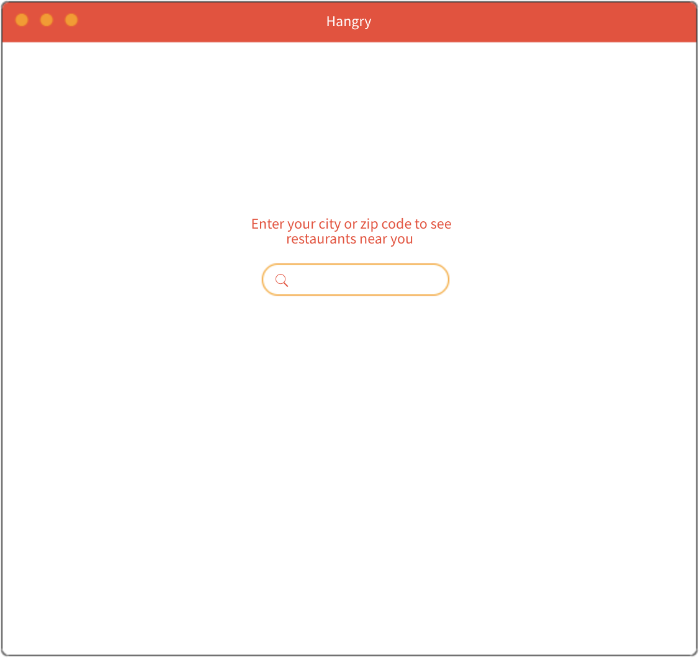
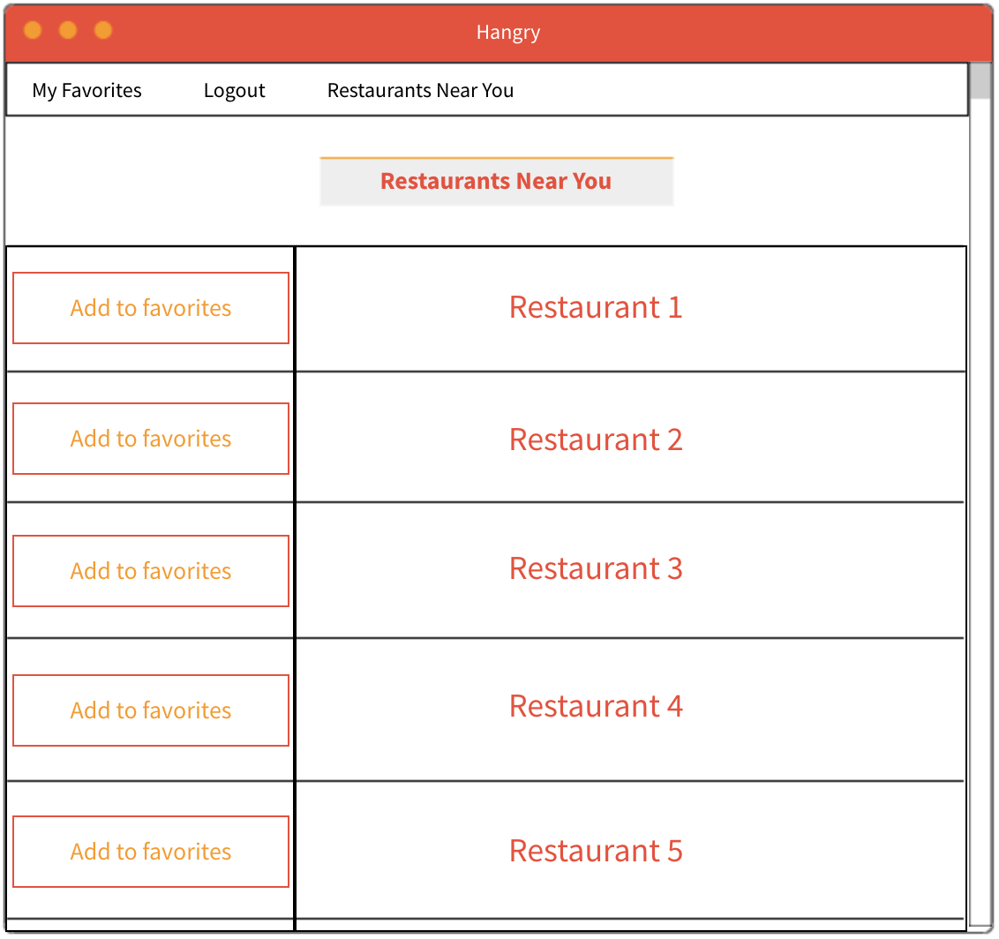
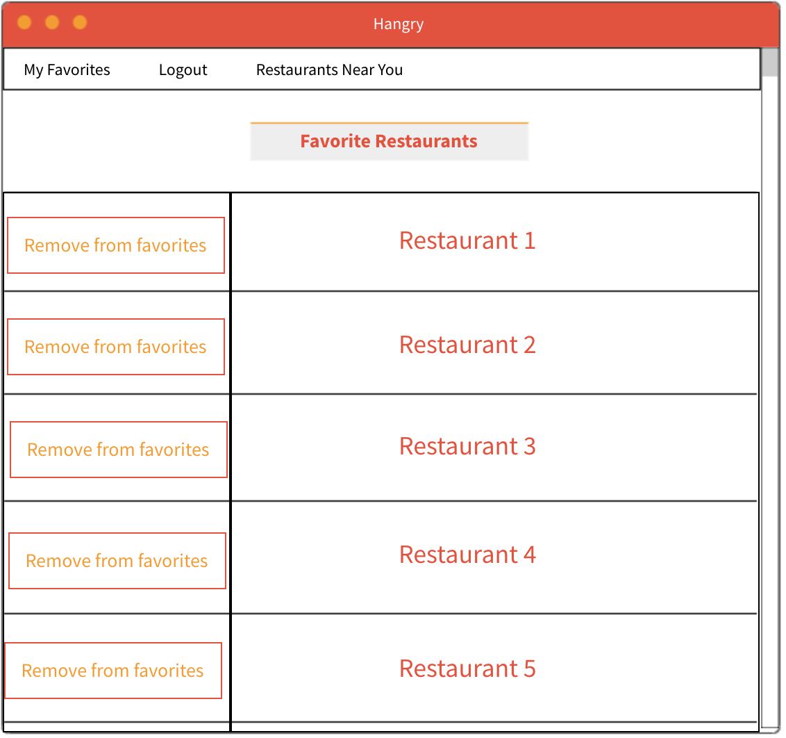
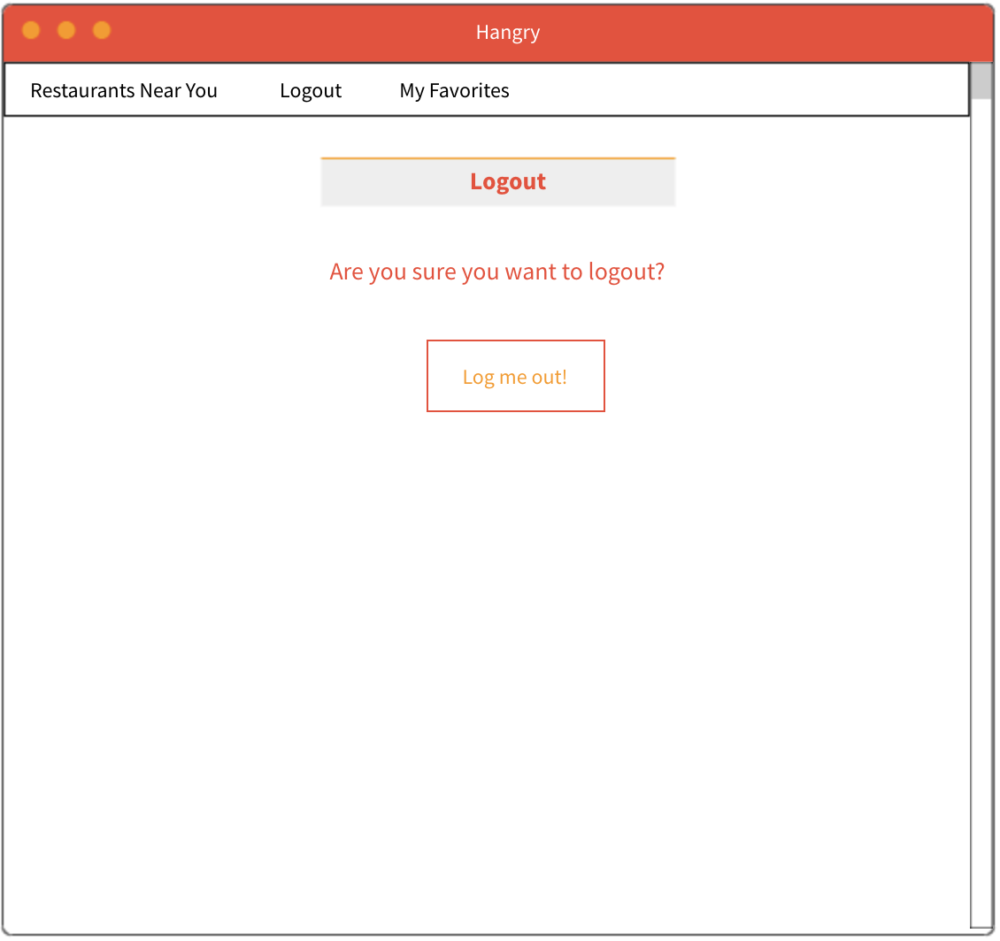
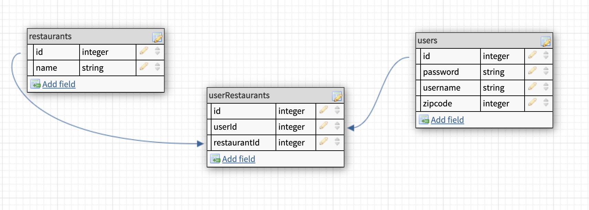

# Hangry
### Hungry but frustrated trying to decide where to eat? You're probably starting to get hangry. Use Hangry to browse restaurants in your area and save your favorites. When you can't make up your mind, simply go to your favorites to jog your memory and help you satisfy your cravings!
## MVP Goals:
* Users are able to login and log out.
* Users favorited restaurants are stored.
* Restaurants a user sees are generated based off either location or search queries. 
## Stretch Goals: 
* Randomly generate a restaurant for the user from their favorites list.
    * Stretch Goal from Stretch Goal: Generate a random restaurant based off the type of food that want to eat.
* Users are able to rate restaurants on their Covid-19 safety level. 
    * Sanitization, enforcement of social distancing guidelines, mask wearing, outdoor dining availability, spacing between tables...
* Display the restaurant menu and hours.
* Link to Postmates API to allow the user to order food. 
## User Stories:
* As a user I will be able to create an account and sign in and out.
* As a user I will be able to view restaurants through either search queries or based on my location (or both) and add resturants to my favorites list. 
* As a user I will be able to view a page with a list of my favorites resturants and remove resturants if I wish. 
## Explanation of APIs to be used: 
i will be using the Documenu API(https://documenu.com/docs#preview_api). This API requires an API key and will allow me to search for restaurants by the users location. 
## Daily Sprints:
* Monday: 
    * Plan database ERD
    * Test API
    * Plan routes
    * Put together wireframes and user stories
* Tuesday: 
    * Create db models and test db
    * Stub and test routes
    * Build routes
* Wednesday:
    * Finish routes 
    * Start on login/logout/auth
    * Create and work on views
* Thursday:
    * Finish login/logout/auth
    * Hopefully hit MVP
    * Finish views
* Friday:
    * Debug and refactor code 
    * Style views
* Saturday: 
    * Style views in CSS
    * Focus on stretch goals
* Sunday:
    * Finish started stretch goals 
    * Add finishing touches

## Wireframes:

### 1. User is able to login or create a new account.

### 2. User enters their location in order to find restaurants in their area.

### 3. Restaurants near the user are displayed and the user can add restaurants to their favorites. Stretch: User would be able to click on each restaurant to get more information on it. 

### 4. The user can see all of their favorites and remove them from the list if they wish. Stretch: User is able to click a button on this page to randomly generate a restaurant from this list for them to eat at.

### 5. Use can logout of their account.
## Database ERD:

## RESTful routing chart:
Method | Url | Functionality | View
-------| ----|---------------|------
GET    | /favorites/:id | View one restaurant | Redirect to /favorites
POST   | /users | Create new user | redirect to index.ejs
POST   | /favorites | Add a restaurant to favorites | Redirect to /favorites
GET    | /favorites | Shows a users favorites list | Redirect to /favorites
DELETE | /favorites/:id | Delete restaurant from favorites | redirect to /favorites
